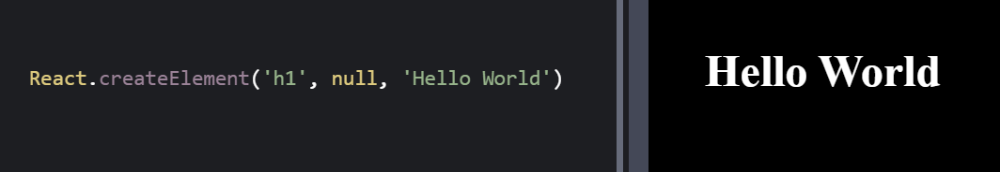
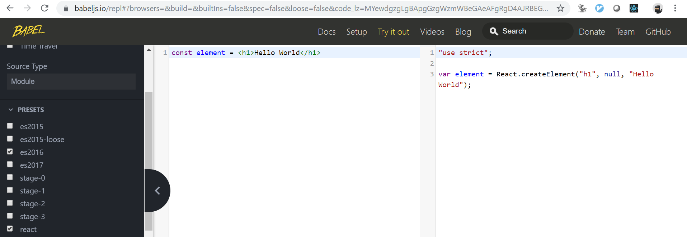

# React

=====

Agenda

* React – Conceptos principales
* JSX
* Renderizado de elementos
* Componentes y tipos de componente
* Props
* State
* Ciclo de vida de los componentes
* Children
* Eventos
* Estilos
* Patrones de diseño
  * [HoC](https://es.reactjs.org/docs/higher-order-components.html)
  * [Render Props](https://reactjs.org/docs/render-props.html)
* [Fragmentos](https://es.reactjs.org/docs/fragments.html)
* [Contexto](https://es.reactjs.org/docs/context.html)
* Error boundaries
* [Lazy/Suspense](https://es.reactjs.org/docs/code-splitting.html)
* Portals
* Hooks
* PureComponent
* React.memo
* Webpack – Conceptos básicos
* create-react-app
* Extensiones VS Code
* [React Developer Tools](https://es.reactjs.org/docs/optimizing-performance.html#virtualize-long-lists)
* Redux – Conceptos básicos
  * Redux Developer Tools
* Otras librerías
  * React Router
  * GraphQL
  * [Formik](https://github.com/jaredpalmer/formik) - Formularios
  * [Downshift](https://github.com/downshift-js/downshift) - dropdown/autocomplete/select
  * [Virtualizar listas largas](https://es.reactjs.org/docs/optimizing-performance.html#virtualize-long-lists)
    * [react-window](https://react-window.now.sh/)
    * [react-virtualized](https://bvaughn.github.io/react-virtualized/)
* Test
  * Jest
  * Enzyme
* Plugin maven para incluir apps react

Ideas

* Rest/Spread props
* Loops
* Ref
* sobreescribir estilos
* Extensiones VS Code
  * sublime-babel-vscode
* Preguntar quien conoce NodeJS, NPM, NPX, React, ES6, Babel y Webpack
* Create-react-app zero configuration
* Synthesize events
* npx create-react-app my-app

=====

* Libreria Javascript para crear interfaces sencillas
* De manera declarativa
* Basadas en Componentes (manejan su propio estado)
* Como un Lego, a partir de piezas sencillas crear estructuras más complejas
* Learn Once, Write Anywhere - DOM, Native, VR

=====

# JSX

* Extensión de JavaScript
* Crear elementos de React

_____

<pre><code data-trim class="hljs">
React.createElement(component, props, ...children)
</code></pre>

_____

<pre><code data-trim class="hljs">
<h1>JSX rocks!!</h1> // Sigue siendo JS
</code></pre>

_____

[Babel REPL](https://babeljs.io/repl)

_____

<pre><code data-trim class="hljs">
console.log(<h1>Hello World</h1>)
</code></pre>

<pre><code data-trim class="hljs">
{
    $$typeof: Symbol(react.element),
    key: null,
    props: {
        children: "Hello World"
    },
    ref: null,
    type: "h1",
    _owner: null,
    __proto__: Object
}
</code></pre>

_____

<pre><code data-trim data-line-numbers class="hljs">
const element =
  React.createElement('div', null,
        React.createElement('p', null,
              React.createElement('h1', null, 'Hello World')))
</code></pre>

<pre><code data-trim data-line-numbers class="hljs">
const element = (
  &lt;div&gt;
    &lt;p&gt;
      &lt;h1&gt;Hello World&lt;/h1&gt;
    &lt;/p&gt;
  &lt;/div&gt;
)
</code></pre>

_____

## Interpolación en JSX

<pre><code data-trim class="hljs">

<%= 1 + 2 %>

</code></pre>

<pre><code data-trim class="hljs">

{ 1 + 2 }

</code></pre>
_____

<pre><code data-trim class="hljs">
const world = 'Mundo'

{ 'Hola ' + world }
 // 
<%= 'Hola ' + world %>

{ `Hola ${world}` }

</code></pre>

_____

<pre><code data-trim class="hljs">
function someFn() {
  return 'someResult'
}

{ someFn() }
 // 
<%= someFn() %>

{ Math.max(2, 5) }

</code></pre>

_____

<pre><code data-trim class="hljs">
const isEmpty = true
&lt;p&gt;
  {
    1 &lt; 2 ? &lt;h3&gt;1 es menor que 2&lt;/h3&gt;
          : undefined
  }
&lt;/p&gt;
&lt;p&gt;
  {
    isEmpty &amp;&amp; &lt;h3&gt;Esta vac&iacute;o&lt;/h3&gt;
  }
&lt;/p&gt;
</code></pre>

=====

## Renderizado

* [CodePen](codepen.io)
  * Preprocesador de Javascript: Babel
  * Librerías:
    * React - Funcionalidad común (createElement, Component, PureComponent, Children...)
    * ReactDOM - Función ligada a aplicaciones web (render, unmountComponentAtNode...)

* [CodeSandbox](codesandbox.io)
  * React template
_____

Learn Once, Write Anywhere

\* [react-dom](https://github.com/facebook/react/tree/master/packages/react-dom), [react-native](https://facebook.github.io/react-native/), [react-vr](https://facebook.github.io/react-360/)...

_____

<pre><code data-trim class="hljs">
ReactDOM.render(<h1>Hello World</h1>, 
                document.getElementById('root'))
</code></pre>

<iframe height="350" style="width: 100%;" scrolling="no" title="HelloWorld" src="https://codepen.io/sapetti/embed/PowqjJd?height=350&theme-id=default&default-tab=html,result&font-size=20px" frameborder="no" allowtransparency="true" allowfullscreen="true">
  See the Pen <a href='https://codepen.io/sapetti/pen/PowqjJd'>HelloWorld</a> by Cesar Sapetti
  (<a href='https://codepen.io/sapetti'>@sapetti</a>) on <a href='https://codepen.io'>CodePen</a>.
</iframe>

_____

<iframe height="600" style="width: 100%;" scrolling="no" title="Tick" src="https://codepen.io/sapetti/embed/dyPozxB?height=600&theme-id=default&default-tab=js,result" frameborder="no" allowtransparency="true" allowfullscreen="true">
  See the Pen <a href='https://codepen.io/sapetti/pen/dyPozxB'>Tick</a> by Cesar Sapetti
  (<a href='https://codepen.io/sapetti'>@sapetti</a>) on <a href='https://codepen.io'>CodePen</a>.
</iframe>

_____

* Hasta ahora solo hemos visto como crear elementos y renderizarlos
* Elementos inmutables (no se pueden cambiar hijos o atributos)
* Normalmente solo habrá un render() por aplicación

=====

### Componentes y Tipos Componentes

<pre><code data-trim class="hljs">
// Function Components
function Hello() {
  return <h1>Hello World</h1>;
}
</code></pre>

<pre><code data-trim class="hljs">
const Hello = () => <h1>Hello World</h1>
</code></pre>

<pre><code data-trim class="hljs">
// Class Components
class Hello extends React.Component {
    render() {
        return <h1>Hello World</h1>;
    }
}
</code></pre>

_____

* El nombre de los componentes deben empezar por mayusculas (Box, UserList, MyComponent...)
* Método render obligatorio en componentes de clase
* Deben devolver
  * Un único elemento
  * Un array de elementos o Fragmentos
  * Portales
  * Strings o numeros
  * Boolean o nulos

_____

En el caso de los componentes usamos JSX

<pre><code data-trim class="hljs">
ReactDOM.render(&lt;Hello /&gt;, document.getElementById('root'))
</code></pre>

<iframe height="350" style="width: 100%;" scrolling="no" title="Hello Component" src="https://codepen.io/sapetti/embed/KKwpXVZ?height=350&theme-id=default&default-tab=js,result" frameborder="no" allowtransparency="true" allowfullscreen="true">
  See the Pen <a href='https://codepen.io/sapetti/pen/KKwpXVZ'>Hello Component</a> by Cesar Sapetti
  (<a href='https://codepen.io/sapetti'>@sapetti</a>) on <a href='https://codepen.io'>CodePen</a>.
</iframe>

=====

## Props

* Los componentes aceptan atributos
* Solo lectura (componentes como funciones puras)
* One way data flow
* camelCase

_____

<pre><code data-trim class="hljs">
function Hello(props) {
  return <h1>Hello { props.name }</h1>;
}
</code></pre>

<iframe height="265" style="width: 100%;" scrolling="no" title="Props" src="https://codepen.io/sapetti/embed/zYxGaNy?height=265&theme-id=default&default-tab=js,result" frameborder="no" allowtransparency="true" allowfullscreen="true">
  See the Pen <a href='https://codepen.io/sapetti/pen/zYxGaNy'>Props</a> by Cesar Sapetti
  (<a href='https://codepen.io/sapetti'>@sapetti</a>) on <a href='https://codepen.io'>CodePen</a>.
</iframe>

_____

<pre><code data-trim class="hljs">
class Hello extends React.Component {
    render() {
        return <h1>Hello {this.props.name}</h1>
    }
}
</code></pre>

<iframe height="265" style="width: 100%;" scrolling="no" title="Props Class" src="https://codepen.io/sapetti/embed/eYmNKWP?height=265&theme-id=default&default-tab=js,result" frameborder="no" allowtransparency="true" allowfullscreen="true">
  See the Pen <a href='https://codepen.io/sapetti/pen/eYmNKWP'>Props Class</a> by Cesar Sapetti
  (<a href='https://codepen.io/sapetti'>@sapetti</a>) on <a href='https://codepen.io'>CodePen</a>.
</iframe>

_____

<pre><code data-trim class="hljs">
&lt;Hello name='Walter' /&gt;

&lt;Hello { name: 'Walter' } /&gt;

function Hello({ name, surname }) {
  return &lt;h1&gt;Hello { name } { surname }&lt;/h1&gt;
}

const user = { name: 'Walter', surname: 'White' }
const element = &lt;Hello { ...user } /&gt;
</code></pre>

_____

## Prop Types

* Comprueba el tipo de las propiedades en tiempo de ejecución
* Solo en modo desarrollo
* String, Boolean, Array, Function, Number, Symbol, Node, Enum...
* Mas de un tipo
* Obligatorio
* Validación personalizada
* No se incluye en la librería de React

_____

<pre><code data-trim class="hljs">
npm i prop-types
</code></pre>

<pre><code data-trim class="hljs">
import PropTypes from 'prop-types'

function Hello({ name, surname }) {
  return <h1>Hello { name } { surname }</h1>
}

Hello.propTypes = {
    name:       PropTypes.string.isRequired,
    surname:    PropTypes.string
}

&lt;Hello surname={2} /&gt;
</code></pre>

_____

## Default Props

<pre><code data-trim class="hljs">
import PropTypes from 'prop-types'

function Hello({ name, surname }) {
  return &lt;h1&gt;Hello { name } { surname }&lt;/h1&gt;
}

Hello.defaultProps = {
    surname: 'White'
}

&lt;Hello name='Walter' /&gt;
// Walter White
</code></pre>

_____

<pre><code data-trim class="hljs">
function Hello({ name, surname = 'White' }) {
  return &lt;h1&gt;Hello { name } { surname }&lt;/h1&gt;
}

&lt;Hello name='Walter' /&gt;
// Walter White
</code></pre>

=====

## State

* El estado es local (componentes de clase***)
* No es accesible desde otro componente
* Cada componente tiene su propio estado
* Crearemos la propiedad de clase state que contendrá el estado del componente
* No modificar el estado directamente
* Usaremos el método setState para actualizarlo
* setState lanza un re-renderizado (salvo excepciones)
* setState puede ser asincrono!!
* setState hace un shallow merge del objeto que se envía con el estado existente

_____

<iframe height="550" style="width: 100%;" scrolling="no" title="Props Class" src="https://codepen.io/sapetti/embed/oNgXPZM?height=550&theme-id=default&default-tab=js,result" frameborder="no" allowtransparency="true" allowfullscreen="true">
  See the Pen <a href='https://codepen.io/sapetti/pen/oNgXPZM'>Props Class</a> by Cesar Sapetti
  (<a href='https://codepen.io/sapetti'>@sapetti</a>) on <a href='https://codepen.io'>CodePen</a>.
</iframe>

_____

* Cada componente tiene su propio estado

<iframe height="550" style="width: 100%;" scrolling="no" title="First State Component" src="https://codepen.io/sapetti/embed/RwNPYjO?height=550&theme-id=default&default-tab=js,result" frameborder="no" allowtransparency="true" allowfullscreen="true">
  See the Pen <a href='https://codepen.io/sapetti/pen/RwNPYjO'>First State Component</a> by Cesar Sapetti
  (<a href='https://codepen.io/sapetti'>@sapetti</a>) on <a href='https://codepen.io'>CodePen</a>.
</iframe>

_____

* setState puede ser asincrono!!

<pre><code data-trim class="hljs">
state = { counter: 0 }
// ...
this.setState({ counter: this.state.counter + 1}) // counter: 0 + 1
this.state.counter // 0

// O

this.setState({ counter: this.state.counter + 1}) // counter: 0 + 1
this.setState({ counter: this.state.counter + 1}) // counter: 0 + 1
// ...
this.state.counter // 1
</code></pre>

_____

<iframe height="650" style="width: 100%;" scrolling="no" title="setState is async" src="https://codepen.io/sapetti/embed/povJOLe?height=650&theme-id=default&default-tab=js,result" frameborder="no" allowtransparency="true" allowfullscreen="true">
  See the Pen <a href='https://codepen.io/sapetti/pen/povJOLe'>setState is async</a> by Cesar Sapetti
  (<a href='https://codepen.io/sapetti'>@sapetti</a>) on <a href='https://codepen.io'>CodePen</a>.
</iframe>

_____

* Mejor usar setState(callback)

<pre><code data-trim class="hljs">
this.setState((state, props) => {
    return { counter: state.counter + 1 }
})
</code></pre>

* setState hace un merge del objeto que se envía con el estado existente

<pre><code data-trim class="hljs">
state = {
    counter: 0,
    user: 'Walter',
}
// ...
this.setState({ user: 'Skyler' })
// state: { counter: 0, user: 'Skyler' }
</code></pre>

=====

## Ciclo de vida

[Métodos comunes del ciclo de vida](http://projects.wojtekmaj.pl/react-lifecycle-methods-diagram/)

* constructor: Para inicializar el estado local o enlazar eventos. Recibe las props y debe hacer super(props)
* render: Obligatorio. Devuelve elementos React, Arrays, Fragmentos, Portales, Strings, Numeros, Booleanos o nulos.

[Reconciliación](https://es.reactjs.org/docs/reconciliation.html)

_____

* componentDidMount: Suscribirse a servicios
* componentDidUpdate
* componentWillUnmount: Borrar las suscripciones a servicios

Según sea necesario, React realizará llamadas a métodos del ciclo de vida de los componentes

* Al crear un componente se llaman los siguientes métodos
  * constructor
  * getDerivedStateFromProps
  * render
  * componentDidMount
* Al lanzar una actualización a través del estado o las props
  * getDerivedStateFromProps
  * shouldComponentUpdate
  * render
  * getSnapshotBeforeUpdate
  * componentDidUpdate
* Al eliminar el componente del DOM
  * componentWillUnmount
* Al ocurrir un error
  * getDerivedStateFromError
  * componentDidCatch

Funciones puras:

* No modifica estado del componente (bucles infinitos)
* Devuelve el mismo resultado para cada vez que se invoca
* No hace side effects

## Styles
