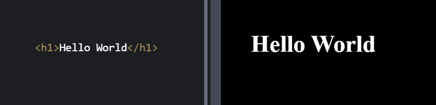
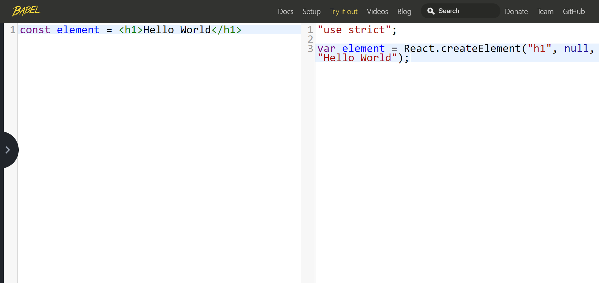

# React

=====

## Agenda

* React – Conceptos principales
* [JSX](https://es.reactjs.org/docs/introducing-jsx.html)
* [Renderizado de elementos](https://es.reactjs.org/docs/rendering-elements.html)
* Componentes y tipos de componente
* Props
* Eventos
* [State](https://es.reactjs.org/docs/react-component.html#setstate)
* [Ciclo de vida de los componentes](https://es.reactjs.org/docs/react-component.html#the-component-lifecycle)
* Children
* Estilos

_____

* Patrones de diseño
* [Ref](https://es.reactjs.org/docs/refs-and-the-dom.html)
* [Fragmentos](https://es.reactjs.org/docs/fragments.html)
* [Contexto](https://es.reactjs.org/docs/context.html)
* [Error boundaries](https://es.reactjs.org/docs/error-boundaries.html)
* [Lazy/Suspense](https://es.reactjs.org/docs/code-splitting.html)
* [Portals](https://es.reactjs.org/docs/portals.html)
* [Hooks](https://es.reactjs.org/docs/hooks-intro.html)
* [PureComponent](https://es.reactjs.org/docs/react-api.html#reactpurecomponent)
* [React.memo](https://es.reactjs.org/blog/2018/10/23/react-v-16-6.html#reactmemo)
* [StrictMode](https://es.reactjs.org/docs/strict-mode.html)

_____

* node/npm/npx
* Módulos
* [Webpack](https://webpack.js.org/) – Conceptos básicos
* create-react-app
* Extensiones VS Code
* [React Developer Tools](https://es.reactjs.org/docs/optimizing-performance.html#virtualize-long-lists)
* Redux – Conceptos básicos
* Otras librerías
* Test
* [Plugin maven para incluir apps react](https://github.com/eirslett/frontend-maven-plugin)

_____

* Amiga - Framework Front
  * Application
  * Router
  * Redux: Actions, Reactions...
  * i18n
  * Logging
  * Mocking
  * Test

=====

* Libreria Javascript para crear interfaces sencillas
* De manera declarativa
* Basadas en Componentes (manejan su propio estado)
* Como un Lego, a partir de piezas sencillas crear estructuras más complejas
* Learn Once, Write Anywhere - [react-dom](https://github.com/facebook/react/tree/master/packages/react-dom), [react-native](https://facebook.github.io/react-native/), [react-vr](https://facebook.github.io/react-360/)...

_____

### [Virtual DOM](https://es.reactjs.org/docs/faq-internals.html)

* React usa un Virtual DOM
* Representación virtual de la UI
* Más ligero que el DOM
* Se usa durante el diffing para repintar solo lo necesario

_____

<iframe loading="lazy" height="600" style="width: 100%;" scrolling="no" title="Tick" src="https://codepen.io/sapetti/embed/preview/dyPozxB?height=600&theme-id=default&default-tab=js,result" frameborder="no" allowtransparency="true" allowfullscreen="true">
  See the Pen <a href='https://codepen.io/sapetti/pen/dyPozxB'>Tick</a> by Cesar Sapetti
  (<a href='https://codepen.io/sapetti'>@sapetti</a>) on <a href='https://codepen.io'>CodePen</a>.
</iframe>

=====

# JSX

* Extensión de JavaScript
* Crear elementos de React

_____

<pre><code data-trim class="hljs">
React.createElement(component, props, ...children)
</code></pre>

_____

<pre><code data-trim class="hljs">
<h1>JSX rocks!!</h1> // Sigue siendo JS
</code></pre>

_____

[Babel REPL](https://babeljs.io/repl)

_____

<pre><code data-trim class="hljs">
console.log(<h1>Hello World</h1>)
</code></pre>

<pre><code data-trim class="hljs">
{
    $$typeof: Symbol(react.element),
    key: null,
    props: {
        children: "Hello World"
    },
    ref: null,
    type: "h1",
    _owner: null,
    __proto__: Object
}
</code></pre>

_____

<pre><code data-trim data-line-numbers class="hljs">
const element =
  React.createElement('div', null,
        React.createElement('p', null,
              React.createElement('h1', null, 'Hello World')))
</code></pre>

<pre><code data-trim data-line-numbers class="hljs">
const element = (
  &lt;div&gt;
    &lt;p&gt;
      &lt;h1&gt;Hello World&lt;/h1&gt;
    &lt;/p&gt;
  &lt;/div&gt;
)
</code></pre>

_____

## Interpolación en JSX

<pre><code data-trim class="hljs">

<%= 1 + 2 %>

</code></pre>

<pre><code data-trim class="hljs">

{ 1 + 2 }

</code></pre>
_____

<pre><code data-trim class="hljs">
const world = 'Mundo'

{ 'Hola ' + world }
 // 
<%= 'Hola ' + world %>

{ `Hola ${world}` }

</code></pre>

[ES6: Template Strings](https://codepen.io/sapetti/pen/KKwbyWm)

_____

<pre><code data-trim class="hljs">
function someFn() {
  return 'someResult'
}

{ someFn() }
 // 
<%= someFn() %>

{ Math.max(2, 5) }

</code></pre>

_____

<pre><code data-trim class="hljs">
const isEmpty = true
&lt;p&gt;
  {
    1 &lt; 2 ? &lt;h3&gt;1 es menor que 2&lt;/h3&gt;
          : undefined
  }
&lt;/p&gt;
&lt;p&gt;
  {
    isEmpty &amp;&amp; &lt;h3&gt;Esta vac&iacute;o&lt;/h3&gt;
  }
&lt;/p&gt;
</code></pre>

=====

## Renderizado

* [codepen.io](https://codepen.io/)
  * Preprocesador de Javascript: Babel
  * Librerías:
    * React - Funcionalidad común (createElement, Component, Children...)
    * ReactDOM - Funcionalidad ligada al navegador (render, mount...)

* [codesandbox.io](https://codesandbox.io/)
  * React template
_____

ReactDOM nos va a permitir renderizar las aplicaciones web

<pre><code data-trim class="hljs">
ReactDOM.render(<h1>Hello World</h1>, 
                document.getElementById('root'))
</code></pre>

_____

### Práctica: primer elemento

1. Abrir codepen.io en el navegador
2. Configurarlo para poder usar React
3. Añadir un div en la pestaña de HTML con el id root
4. En la pestaña de JS, usar la función render para pintar un componente con un "Hola Mundo" en el div anterior
5. Inspeccionar con DevTools el resultado

_____

<iframe loading="lazy" height="600" style="width: 100%;" scrolling="no" title="HelloWorld" src="https://codepen.io/sapetti/embed/preview/PowqjJd?height=600&theme-id=default&default-tab=html,result&font-size=20px" frameborder="no" allowtransparency="true" allowfullscreen="true">
  See the Pen <a href='https://codepen.io/sapetti/pen/PowqjJd'>HelloWorld</a> by Cesar Sapetti
  (<a href='https://codepen.io/sapetti'>@sapetti</a>) on <a href='https://codepen.io'>CodePen</a>.
</iframe>

_____

* Hasta ahora solo hemos visto como crear elementos y renderizarlos
* Los elementos son inmutables (no se pueden cambiar hijos o atributos)
* Normalmente solo habrá un render() por aplicación

=====

### Componentes

<pre><code data-trim class="hljs">
// Function Components
function Hello() {
  return <h1>Hello World</h1>;
}
</code></pre>

<pre><code data-trim class="hljs">
const Hello = () => <h1>Hello World</h1>
</code></pre>

<pre><code data-trim class="hljs">
// Class Components
class Hello extends React.Component {
    render() {
        return <h1>Hello World</h1>;
    }
}
</code></pre>

[ES6: Arrow Functions](https://codepen.io/sapetti/pen/NWPyZoR)

_____

* El nombre de los componentes deben empezar por mayusculas (Box, UserList, MyComponent...)
* Método render obligatorio en componentes de clase
* Deben devolver
  * Un único elemento
  * Un array de elementos o Fragmentos
  * Portales
  * Strings o numeros
  * Boolean o nulos

_____

En el caso de los componentes usamos JSX

<pre><code data-trim class="hljs">
ReactDOM.render(&lt;Hello /&gt;, document.getElementById('root'))
</code></pre>

<iframe loading="lazy" height="350" style="width: 100%;" scrolling="no" title="Hello Component" src="https://codepen.io/sapetti/embed/preview/KKwpXVZ?height=350&theme-id=default&default-tab=js,result" frameborder="no" allowtransparency="true" allowfullscreen="true">
  See the Pen <a href='https://codepen.io/sapetti/pen/KKwpXVZ'>Hello Component</a> by Cesar Sapetti
  (<a href='https://codepen.io/sapetti'>@sapetti</a>) on <a href='https://codepen.io'>CodePen</a>.
</iframe>

_____

### Práctica: Primer componente de función

1. Modificar el ejercicio anterior creando un componente de función que devuelva un h1 con un Hola Mundo
2. Cambiar en la llamada al render para usar el componente usando JSX

_____

### Práctica: Primer componente de función flecha

1. Modificar el ejercicio para usar una función flecha

_____

### Práctica: Primer componente de clase

1. Modificar el ejercicio para usar una clase. No olvidar el método render

=====

## Props

* Los componentes aceptan atributos
* Solo lectura (componentes como funciones puras)
* One way data flow
* camelCase

_____

<pre><code data-trim class="hljs">
function Hello(props) {
  return <h1>Hello { props.name }</h1>;
}
</code></pre>

<iframe loading="lazy" height="400" style="width: 100%;" scrolling="no" title="Props" src="https://codepen.io/sapetti/embed/preview/zYxGaNy?height=400&theme-id=default&default-tab=js,result" frameborder="no" allowtransparency="true" allowfullscreen="true">
  See the Pen <a href='https://codepen.io/sapetti/pen/zYxGaNy'>Props</a> by Cesar Sapetti
  (<a href='https://codepen.io/sapetti'>@sapetti</a>) on <a href='https://codepen.io'>CodePen</a>.
</iframe>

[ES6: Object destructuring](https://codepen.io/sapetti/pen/YzPeoEB)

_____

<pre><code data-trim class="hljs">
class Hello extends React.Component {
    render() {
        return <h1>Hello {this.props.name}</h1>
    }
}
</code></pre>

<iframe loading="lazy" height="400" style="width: 100%;" scrolling="no" title="Props Class" src="https://codepen.io/sapetti/embed/preview/eYmNKWP?height=400&theme-id=default&default-tab=js,result" frameborder="no" allowtransparency="true" allowfullscreen="true">
  See the Pen <a href='https://codepen.io/sapetti/pen/eYmNKWP'>Props Class</a> by Cesar Sapetti
  (<a href='https://codepen.io/sapetti'>@sapetti</a>) on <a href='https://codepen.io'>CodePen</a>.
</iframe>

_____

<pre><code data-trim class="hljs">
function Hello({ name, surname }) {
  return &lt;h1&gt;Hello { name } { surname }&lt;/h1&gt;
}

&lt;Hello name='Walter' surname={ 'White' } /&gt;

&lt;Hello { name: 'Walter', surname: 'White' } /&gt;

const user = { name: 'Walter', surname: 'White' }
&lt;Hello { ...user } /&gt;
</code></pre>

[ES6: Spread Syntax](https://codepen.io/sapetti/pen/eYmMvbx)

_____

## Prop Types

* Comprueba el tipo de las propiedades en tiempo de ejecución
* Solo en modo desarrollo
* String, Boolean, Array, Function, Number, Symbol, Node, Enum...
* Mas de un tipo
* Obligatorio
* Validación personalizada
* No se incluye en la librería de React

_____

<pre><code data-trim class="hljs">
npm i prop-types
</code></pre>

<pre><code data-trim class="hljs">
import PropTypes from 'prop-types'

function Hello({ name, surname }) {
  return <h1>Hello { name } { surname }</h1>
}

Hello.propTypes = {
    name:       PropTypes.string.isRequired,
    surname:    PropTypes.string
}

&lt;Hello surname={2} /&gt;
</code></pre>

_____

El mensaje de error solo se muestra en **modo desarrollo**

_____

## Default Props

<pre><code data-trim class="hljs">
import PropTypes from 'prop-types'

function Hello({ name, surname }) {
  return &lt;h1&gt;Hello { name } { surname }&lt;/h1&gt;
}

Hello.defaultProps = {
    surname: 'White'
}

&lt;Hello name='Walter' /&gt;
// Walter White
</code></pre>

_____

<pre><code data-trim class="hljs">
function Hello({ name, surname = 'White' }) {
  return &lt;h1&gt;Hello { name } { surname }&lt;/h1&gt;
}

&lt;Hello name='Walter' /&gt;
// Walter White
</code></pre>

[ES6: Default Value](https://codepen.io/sapetti/pen/PowRpvK)

_____

### Práctica: Crear un componente que reciba propiedades

1. Modificar el ejercicio anterior para que el componente en vez de mostrar Hola Mundo, muestre Hola y el nombre y apellido que se pase como props
2. Establecer que las propiedades nombre y apellido sean de tipo String
3. Establecer que nombre sea obligatorio
4. Asignarle un valor por defecto al apellido

_____

<iframe loading="lazy" height="600" style="width: 100%;" scrolling="no" title="PropTypes" src="https://codepen.io/sapetti/embed/preview/JjoLJGr?height=600&theme-id=default&default-tab=js,result" frameborder="no" allowtransparency="true" allowfullscreen="true">
  See the Pen <a href='https://codepen.io/sapetti/pen/JjoLJGr'>PropTypes</a> by Cesar Sapetti
  (<a href='https://codepen.io/sapetti'>@sapetti</a>) on <a href='https://codepen.io'>CodePen</a>.
</iframe>

=====

## Eventos

* Igual que los eventos en el DOM pero en camelCase
  onclick -> onClick, onchange -> onChange
* Reciben una función y no un string
  onclick="requestData()" -> onClick={requestData}
* Hay que llamar a preventDefault, no podemos devolver false para evitarlo
* El handler recibe un evento sintético de React (evita problemas de incompatibilidad entre navegadores)
* [Listado de eventos soportados](https://es.reactjs.org/docs/events.html#supported-events)

_____

#### Definición de handlers - Funciones flecha

<iframe loading="lazy" height="400" style="width: 100%;" scrolling="no" title="Events - Arrow Functions" src="https://codepen.io/sapetti/embed/preview/WNbrpEV?height=400&theme-id=default&default-tab=js,result" frameborder="no" allowtransparency="true" allowfullscreen="true">
  See the Pen <a href='https://codepen.io/sapetti/pen/WNbrpEV'>Events - Arrow Functions</a> by Cesar Sapetti
  (<a href='https://codepen.io/sapetti'>@sapetti</a>) on <a href='https://codepen.io'>CodePen</a>.
</iframe>

Problemas de performance

_____

#### Definición de handlers - Bind

<iframe loading="lazy" height="400" style="width: 100%;" scrolling="no" title="Events - Bind" src="https://codepen.io/sapetti/embed/preview/LYEGLPP?height=400&theme-id=default&default-tab=js,result" frameborder="no" allowtransparency="true" allowfullscreen="true">
  See the Pen <a href='https://codepen.io/sapetti/pen/LYEGLPP'>Events - Bind</a> by Cesar Sapetti
  (<a href='https://codepen.io/sapetti'>@sapetti</a>) on <a href='https://codepen.io'>CodePen</a>.
</iframe>

Mucho código y muy repetitivo

_____

#### Definición de handlers - Campos públicos de clases

<iframe loading="lazy" height="400" style="width: 100%;" scrolling="no" title="Events - Public field" src="https://codepen.io/sapetti/embed/preview/bGNERGo?height=400&theme-id=default&default-tab=js,result" frameborder="no" allowtransparency="true" allowfullscreen="true">
  See the Pen <a href='https://codepen.io/sapetti/pen/bGNERGo'>Events - Public field</a> by Cesar Sapetti
  (<a href='https://codepen.io/sapetti'>@sapetti</a>) on <a href='https://codepen.io'>CodePen</a>.
</iframe>

Experimental. Por defecto incluida con create-react-app

_____

### Práctica: Eventos

1. Crear una App que tenga un textbox
2. Añadirle un handler que se ejecute cuando se escriba en el textbox
3. El handler mostrará por consola el texto que se esta escribiendo

=====

## State

* Cada componente tiene su propio estado
* El estado es local
* Solo para componentes de clase***
* No es accesible desde otro componente
* Crearemos la propiedad de clase state que contendrá el estado del componente
* No modificar el estado directamente

_____

### setState

* Usaremos el método setState para actualizarlo
* setState lanza un re-renderizado (salvo excepciones)
* setState puede ser asincrono!!
* setState hace un shallow merge del objeto que se envía con el estado existente

_____

<iframe loading="lazy" height="550" style="width: 100%;" scrolling="no" title="Props Class" src="https://codepen.io/sapetti/embed/preview/oNgXPZM?height=550&theme-id=default&default-tab=js,result" frameborder="no" allowtransparency="true" allowfullscreen="true">
  See the Pen <a href='https://codepen.io/sapetti/pen/oNgXPZM'>Props Class</a> by Cesar Sapetti
  (<a href='https://codepen.io/sapetti'>@sapetti</a>) on <a href='https://codepen.io'>CodePen</a>.
</iframe>

_____

Cada componente tiene su propio estado

<iframe loading="lazy" height="550" style="width: 100%;" scrolling="no" title="First State Component" src="https://codepen.io/sapetti/embed/preview/RwNPYjO?height=550&theme-id=default&default-tab=js,result" frameborder="no" allowtransparency="true" allowfullscreen="true">
  See the Pen <a href='https://codepen.io/sapetti/pen/RwNPYjO'>First State Component</a> by Cesar Sapetti
  (<a href='https://codepen.io/sapetti'>@sapetti</a>) on <a href='https://codepen.io'>CodePen</a>.
</iframe>

_____

setState puede ser asincrono!!

<pre><code data-trim class="hljs">
state = { counter: 0 }
// ...
this.setState({ counter: this.state.counter + 1}) // counter: 0 + 1
this.state.counter // 0

// O

this.setState({ counter: this.state.counter + 1}) // counter: 0 + 1
this.setState({ counter: this.state.counter + 1}) // counter: 0 + 1
// ...
this.state.counter // 1
</code></pre>

_____

<iframe loading="lazy" height="650" style="width: 100%;" scrolling="no" title="setState is async" src="https://codepen.io/sapetti/embed/preview/povJOLe?height=650&theme-id=default&default-tab=js,result" frameborder="no" allowtransparency="true" allowfullscreen="true">
  See the Pen <a href='https://codepen.io/sapetti/pen/povJOLe'>setState is async</a> by Cesar Sapetti
  (<a href='https://codepen.io/sapetti'>@sapetti</a>) on <a href='https://codepen.io'>CodePen</a>.
</iframe>

_____

Mejor usar setState(callback)

<pre><code data-trim class="hljs">
this.setState((state, props) => {
    return { counter: state.counter + 1 }
})
</code></pre>

_____

<iframe loading="lazy" height="650" style="width: 100%;" scrolling="no" title="setState is async" src="https://codepen.io/sapetti/embed/preview/rNaVqgE?height=650&theme-id=default&default-tab=js,result" frameborder="no" allowtransparency="true" allowfullscreen="true">
  See the Pen <a href='https://codepen.io/sapetti/pen/rNaVqgE'>setState is async</a> by Cesar Sapetti
  (<a href='https://codepen.io/sapetti'>@sapetti</a>) on <a href='https://codepen.io'>CodePen</a>.
</iframe>

_____

setState hace un merge shallow del objeto que se envía con el estado existente

<pre><code data-trim class="hljs">
state = {
    counter: 0,
    user: 'Walter',
}
// ...
this.setState({ user: 'Skyler' })
// state: { counter: 0, user: 'Skyler' }
</code></pre>

_____

Ojo con los objetos
<iframe loading="lazy" height="600" style="width: 100%;" scrolling="no" title="setState shallow merge" src="https://codepen.io/sapetti/embed/preview/BayNGar?height=600&theme-id=default&default-tab=js,result" frameborder="no" allowtransparency="true" allowfullscreen="true">
  See the Pen <a href='https://codepen.io/sapetti/pen/BayNGar'>setState shallow merge</a> by Cesar Sapetti
  (<a href='https://codepen.io/sapetti'>@sapetti</a>) on <a href='https://codepen.io'>CodePen</a>.
</iframe>

_____

### Práctica: Estado

1. Modificar el ejercicio anterior para almacenar el texto en el estado
2. Añadir una label donde se muestre este estado

=====

## Componentes controlados y no controlados

* Los componentes controlados son aquellos en los que cada campo del formulario tiene un handler para cambios
* Los componentes no controlados son aquellos que no tienen handlers por cada campo y recopilan el estado en un único momento (onSubmit)

_____

### Componentes controlados

<iframe loading="lazy" height="600" style="width: 100%;" scrolling="no" title="Controlado" src="https://codepen.io/sapetti/embed/preview/qBExEMb?height=600&theme-id=default&default-tab=js,result" frameborder="no" allowtransparency="true" allowfullscreen="true">
  See the Pen <a href='https://codepen.io/sapetti/pen/qBExEMb'>Controlado</a> by Cesar Sapetti
  (<a href='https://codepen.io/sapetti'>@sapetti</a>) on <a href='https://codepen.io'>CodePen</a>.
</iframe>

_____

### Componentes no controlados

<iframe loading="lazy" height="600" style="width: 100% !important;" scrolling="no" title="No Controlado" src="https://codepen.io/sapetti/embed/preview/VwYQevY?height=600&theme-id=default&default-tab=js,result" frameborder="no" allowtransparency="true" allowfullscreen="true">
  See the Pen <a href='https://codepen.io/sapetti/pen/VwYQevY'>No Controlado</a> by Cesar Sapetti
  (<a href='https://codepen.io/sapetti'>@sapetti</a>) on <a href='https://codepen.io'>CodePen</a>.
</iframe>

=====

## Ciclo de vida

[Métodos comunes del ciclo de vida](http://projects.wojtekmaj.pl/react-lifecycle-methods-diagram/)

[React Reconciliation](https://es.reactjs.org/docs/reconciliation.html)

_____

Funciones puras:

* No hace side effects
* No modifica estado del componente (bucles infinitos)
* Devuelve el mismo resultado para cada vez que se invoca

_____

### Render phase

* constructor: Para inicializar el estado local o enlazar eventos. Recibe las props y debe hacer super(props).
* render: Obligatorio. Devuelve elementos React, Arrays, Fragmentos, Portales, Strings, Numeros, Booleanos o nulos.

_____

### Commit phase

* componentDidMount: Suscribirse a servicios.
* componentDidUpdate: Realizar operaciones en el DOM tras una actualización o peticiones de red. Recibe el estado y las propiedades anteriores. Cuidado si se llama setState, puede crear un bucle infinito.
* componentWillUnmount: Borrar las suscripciones a servicios.

_____

<iframe loading="lazy" height="600" style="width: 100%;" scrolling="no" title="Component lifecycle" src="https://codepen.io/sapetti/embed/preview/GRgJPOb?height=600&theme-id=default&default-tab=js,result" frameborder="no" allowtransparency="true" allowfullscreen="true">
  See the Pen <a href='https://codepen.io/sapetti/pen/GRgJPOb'>Component lifecycle</a> by Cesar Sapetti
  (<a href='https://codepen.io/sapetti'>@sapetti</a>) on <a href='https://codepen.io'>CodePen</a>.
</iframe>
_____

Hay más métodos.

Según sea necesario, React realizará llamadas a métodos del ciclo de vida de los componentes

_____

* Al crear un componente se llaman los siguientes métodos
  * constructor
  * getDerivedStateFromProps
  * render
  * componentDidMount

_____

* Al lanzar una actualización a través del estado o las props
  * getDerivedStateFromProps
  * shouldComponentUpdate
  * render
  * getSnapshotBeforeUpdate
  * componentDidUpdate

_____

* Al eliminar el componente del DOM
  * componentWillUnmount

_____

* Al ocurrir un error
  * getDerivedStateFromError
  * componentDidCatch

=====

## Children

* Los componentes pueden tener ningun, uno o varios hijos
* Podemos usar la API de **React.Children** para tratarlos
* Favorecen la composición

_____

<iframe loading="lazy" height="600" style="width: 100%;" scrolling="no" title="props.children" src="https://codepen.io/sapetti/embed/preview/KKwdrrL?height=600&theme-id=default&default-tab=js,result" frameborder="no" allowtransparency="true" allowfullscreen="true">
  See the Pen <a href='https://codepen.io/sapetti/pen/KKwdrrL'>props.children</a> by Cesar Sapetti
  (<a href='https://codepen.io/sapetti'>@sapetti</a>) on <a href='https://codepen.io'>CodePen</a>.
</iframe>

_____

* props.children puede ser de cualquier tipo (array, objeto, función...)
* Esto hace que trabajar con los hijos sea un poco caótico

_____

Un unico hijo no funciona en este ejemplo

<iframe loading="lazy" height="600" style="width: 100%;" scrolling="no" title="props.children fail!" src="https://codepen.io/sapetti/embed/preview/bGNVQZO?height=600&theme-id=default&default-tab=js,result" frameborder="no" allowtransparency="true" allowfullscreen="true">
  See the Pen <a href='https://codepen.io/sapetti/pen/bGNVQZO'>props.children fail!</a> by Cesar Sapetti
  (<a href='https://codepen.io/sapetti'>@sapetti</a>) on <a href='https://codepen.io'>CodePen</a>.
</iframe>

_____

React.Children

<iframe loading="lazy" height="600" style="width: 150%;" scrolling="no" title="React.Children" src="https://codepen.io/sapetti/embed/preview/NWPxdxX?height=600&theme-id=default&default-tab=js,result" frameborder="no" allowtransparency="true" allowfullscreen="true">
  See the Pen <a href='https://codepen.io/sapetti/pen/NWPxdxX'>React.Children</a> by Cesar Sapetti
  (<a href='https://codepen.io/sapetti'>@sapetti</a>) on <a href='https://codepen.io'>CodePen</a>.
</iframe>

_____

API React.Children

* map
* count
* forEach (como map pero devuelve un array)
* toArray (para ordenación)
* only (forzar que solo se pueda poner un hijo)

=====

## Estilos

* Hay distintas formas de aplicar estilos
* No hay una que predomine sobre las otras
* Todas tienen pros y contras

_____

### Estilos en línea

* Pasar los estilos al atributo **style**
* Los estilos deben pasarse como un objeto
* Las nombres de las propiedades son __camelCase__ (font-weight -> fontWeight)

_____

<iframe loading="lazy" height="600" style="width: 100%;" scrolling="no" title="Inline style" src="https://codepen.io/sapetti/embed/preview/povjOme?height=600&theme-id=default&default-tab=js,result" frameborder="no" allowtransparency="true" allowfullscreen="true">
  See the Pen <a href='https://codepen.io/sapetti/pen/povjOme'>Inline style</a> by Cesar Sapetti
  (<a href='https://codepen.io/sapetti'>@sapetti</a>) on <a href='https://codepen.io'>CodePen</a>.
</iframe>

_____

Podemos extraer los estilos a un objeto

<iframe loading="lazy" height="500" style="width: 100%;" scrolling="no" title="Inline style object" src="https://codepen.io/sapetti/embed/preview/yLyYRaz?height=500&theme-id=default&default-tab=js,result" frameborder="no" allowtransparency="true" allowfullscreen="true">
  See the Pen <a href='https://codepen.io/sapetti/pen/yLyYRaz'>Inline style object</a> by Cesar Sapetti
  (<a href='https://codepen.io/sapetti'>@sapetti</a>) on <a href='https://codepen.io'>CodePen</a>.
</iframe>

_____

### CSS-in-JS

* Escribir CSS usando JS
* Utilizando librerías como:
  * [glamorous](https://glamorous.rocks/)
  * [styled-components](https://www.styled-components.com/)
  * [Emotion](https://emotion.sh/docs/introduction)

_____

#### styled-components

<iframe loading="lazy" height="500" style="width: 100%;" scrolling="no" title="CSS-in-JS" src="https://codepen.io/sapetti/embed/preview/LYEpXQb?height=500&theme-id=default&default-tab=js,result" frameborder="no" allowtransparency="true" allowfullscreen="true">
  See the Pen <a href='https://codepen.io/sapetti/pen/LYEpXQb'>CSS-in-JS</a> by Cesar Sapetti
  (<a href='https://codepen.io/sapetti'>@sapetti</a>) on <a href='https://codepen.io'>CodePen</a>.
</iframe>

[Plantillas de cadena de texto con postprocesador](https://developer.mozilla.org/es/docs/Web/JavaScript/Referencia/template_strings)

_____

### Hojas de estilo CSS

* Posible usando los [Loaders](https://webpack.js.org/loaders/) de Webpack
* Importamos el fichero CSS de estilos directamente (se puede hacer también con imágenes)
* Se puede importar una hoja de estilos en el raíz de la aplicación para aplicar a todos

_____

* O podemos importar una hoja de estilo por componente 
  
  

_____

### className

* **class** es una palabra reservada
* En su lugar usaremos className
* React nos advierte si no lo cumplimos

_____

<iframe loading="lazy" height="600" style="width: 100%;" scrolling="no" title="className" src="https://codepen.io/sapetti/embed/preview/oNgjaor?height=600&theme-id=default&default-tab=js,result" frameborder="no" allowtransparency="true" allowfullscreen="true">
  See the Pen <a href='https://codepen.io/sapetti/pen/oNgjaor'>className</a> by Cesar Sapetti
  (<a href='https://codepen.io/sapetti'>@sapetti</a>) on <a href='https://codepen.io'>CodePen</a>.
</iframe>

=====

### Práctica

Crear una app para buscar usuarios de [GitHub](https://api.github.com/search/users?q=${sapetti}) usando:

* [Promesas de ES6](https://developer.mozilla.org/es/docs/Web/JavaScript/Referencia/Objetos_globales/Promise)
* [API de fetch](https://developer.mozilla.org/es/docs/Web/API/Fetch_API)
* [Debounce para promesas](https://stackoverflow.com/a/54265129/6686114)

_____

* Añadir un input para introducir la busqueda
* Buscar cuando se introduzcan 3 caracteres
* Guardar el resultado en el estado
* Mostrar el resultado en una tabla
  * Avatar como imagen
  * Login como link a la cuenta del usuario
  * Link a sus repos
* Se debe aplicar algún estilo a la tabla (color de la fuente, bordes...)

_____

<iframe loading="lazy" height="600" style="width: 100%;" scrolling="no" title="SearchUsers" src="https://codepen.io/sapetti/embed/preview/vYEMoEb?height=600&theme-id=default&default-tab=js,result" frameborder="no" allowtransparency="true" allowfullscreen="true">
  See the Pen <a href='https://codepen.io/sapetti/pen/vYEMoEb'>SearchUsers</a> by Cesar Sapetti
  (<a href='https://codepen.io/sapetti'>@sapetti</a>) on <a href='https://codepen.io'>CodePen</a>.
</iframe>

Ojo a las keys!!
_____

<iframe
     src="https://codesandbox.io/embed/great-sky-pgztn?fontsize=14&hidenavigation=1&theme=dark"
     style="width:100%; height:600px; border:0; border-radius: 4px; overflow:hidden;"
     title="great-sky-pgztn"
     allow="geolocation; microphone; camera; midi; vr; accelerometer; gyroscope; payment; ambient-light-sensor; encrypted-media; usb"
     sandbox="allow-modals allow-forms allow-popups allow-scripts allow-same-origin"
   ></iframe>

=====

## Patrones de diseño

### [Higher Order Components - HOC](https://es.reactjs.org/docs/higher-order-components.html)

* Función que recibe un componente y devuelve un nuevo componente
* Se envuelve el componente que se recibe con una funcionalidad
* Se usa en librerías como Redux o Relay

_____

<iframe loading="lazy" height="650" style="width: 100%;" scrolling="no" title="HOC" src="https://codepen.io/sapetti/embed/preview/ExaWxxg?height=650&theme-id=default&default-tab=js,result" frameborder="no" allowtransparency="true" allowfullscreen="true">
  See the Pen <a href='https://codepen.io/sapetti/pen/ExaWxxg'>HOC</a> by Cesar Sapetti
  (<a href='https://codepen.io/sapetti'>@sapetti</a>) on <a href='https://codepen.io'>CodePen</a>.
</iframe>

_____

### [Render Props](https://reactjs.org/docs/render-props.html)

* Un attributo que recibe una función que devuelve un elemento
* El elemento con la Render Prop se encargará de llamar a la función
* No se tiene porque llamar render, pero es algo común
* Se usa en librerías como React Router

_____

<iframe loading="lazy" height="600" style="width: 100%;" scrolling="no" title="Render Props" src="https://codepen.io/sapetti/embed/preview/eYmVZzm?height=600&theme-id=default&default-tab=js,result" frameborder="no" allowtransparency="true" allowfullscreen="true">
  See the Pen <a href='https://codepen.io/sapetti/pen/eYmVZzm'>Render Props</a> by Cesar Sapetti
  (<a href='https://codepen.io/sapetti'>@sapetti</a>) on <a href='https://codepen.io'>CodePen</a>.
</iframe>

=====

## Ref

Es una forma de acceder a los nodos del DOM o a elementos creados en el metodo de renderizado

* Controlar el foco
* Selección de texto
* Reproducción de medios
* Inputs de tipo file

_____

<iframe loading="lazy" height="600" style="width: 100%;" scrolling="no" title="Refs" src="https://codepen.io/sapetti/embed/preview/OJPQPXm?height=600&theme-id=default&default-tab=js,result" frameborder="no" allowtransparency="true" allowfullscreen="true">
  See the Pen <a href='https://codepen.io/sapetti/pen/OJPQPXm'>Refs</a> by Cesar Sapetti
  (<a href='https://codepen.io/sapetti'>@sapetti</a>) on <a href='https://codepen.io'>CodePen</a>.
</iframe>

=====

## Fragmentos

* Al inspeccionar la mayoria de aplicaciones React resultaba en muchos divs debido wrapping que se hacia de los elementos
* Permiten agrupar elementos sin agregar nodos al DOM
* Permiten sintaxis corta

_____

Sin fragmentos

<iframe loading="lazy" height="600" style="width: 100%;" scrolling="no" title="Without Fragments" src="https://codepen.io/sapetti/embed/preview/ZEYrpJV?height=600&theme-id=default&default-tab=js,result" frameborder="no" allowtransparency="true" allowfullscreen="true">
  See the Pen <a href='https://codepen.io/sapetti/pen/ZEYrpJV'>Without Fragments</a> by Cesar Sapetti
  (<a href='https://codepen.io/sapetti'>@sapetti</a>) on <a href='https://codepen.io'>CodePen</a>.
</iframe>

_____

Con fragmentos

<iframe loading="lazy" height="600" style="width: 100%;" scrolling="no" title="With Fragments" src="https://codepen.io/sapetti/embed/preview/XWJZjYL?height=600&theme-id=default&default-tab=js,result" frameborder="no" allowtransparency="true" allowfullscreen="true">
  See the Pen <a href='https://codepen.io/sapetti/pen/XWJZjYL'>With Fragments</a> by Cesar Sapetti
  (<a href='https://codepen.io/sapetti'>@sapetti</a>) on <a href='https://codepen.io'>CodePen</a>.
</iframe>

_____

Con fragmentos sintaxis corta

<iframe loading="lazy" height="600" style="width: 100%;" scrolling="no" title="With Fragments Shorthand Syntax" src="https://codepen.io/sapetti/embed/preview/YzPeGOp?height=600&theme-id=default&default-tab=js,result" frameborder="no" allowtransparency="true" allowfullscreen="true">
  See the Pen <a href='https://codepen.io/sapetti/pen/YzPeGOp'>With Fragments Shorthand Syntax</a> by Cesar Sapetti
  (<a href='https://codepen.io/sapetti'>@sapetti</a>) on <a href='https://codepen.io'>CodePen</a>.
</iframe>

=====

## Contexto

* Pasar la propiedades por todo el arbol puede ser algo tedioso
* En ocasiones a algunos componentes les llegaran propiedades que no usarán y que tendrán que pasar a sus hijos
* La API de Contexto permite a los hijos acceder al valor que tiene un componente padre sin tener que pasarla a través de todos los niveles del arbol
* Ejemplos más comunes de uso: Información del usuario, su locale o el tema de UI

_____

Sin la API de Contexto

<iframe loading="lazy" height="550" style="width: 100%;" scrolling="no" title="Without Context" src="https://codepen.io/sapetti/embed/preview/dyPdaOW?height=550&theme-id=default&default-tab=js,result" frameborder="no" allowtransparency="true" allowfullscreen="true">
  See the Pen <a href='https://codepen.io/sapetti/pen/dyPdaOW'>Without Context</a> by Cesar Sapetti
  (<a href='https://codepen.io/sapetti'>@sapetti</a>) on <a href='https://codepen.io'>CodePen</a>.
</iframe>

_____

Con la API de Contexto - Consumer

<iframe loading="lazy" height="550" style="width: 100%;" scrolling="no" title="With Context" src="https://codepen.io/sapetti/embed/preview/PowQVBy?height=550&theme-id=default&default-tab=js,result" frameborder="no" allowtransparency="true" allowfullscreen="true">
  See the Pen <a href='https://codepen.io/sapetti/pen/PowQVBy'>With Context</a> by Cesar Sapetti
  (<a href='https://codepen.io/sapetti'>@sapetti</a>) on <a href='https://codepen.io'>CodePen</a>.
</iframe>

Mejor cuando se usan varios contextos

_____

Con la API de Contexto - contextType

<iframe loading="lazy" height="550" style="width: 100%;" scrolling="no" title="With Context contextType" src="https://codepen.io/sapetti/embed/preview/YzPeBmv?height=550&theme-id=default&default-tab=js,result" frameborder="no" allowtransparency="true" allowfullscreen="true">
  See the Pen <a href='https://codepen.io/sapetti/pen/YzPeBmv'>With Context contextType</a> by Cesar Sapetti
  (<a href='https://codepen.io/sapetti'>@sapetti</a>) on <a href='https://codepen.io'>CodePen</a>.
</iframe>

_____

* Solo debe usarse para propiedades que deben ser repartidas por muchos componentes en distintas ramas del arbol
* [Ojo con la forma de pasar objetos al Contexto](https://reactjs.org/docs/context.html#caveats)
* contextType solo permite subscribirse a un único contexto, si se necesitan varios es mejor usar el Consumer
* Si se necesitan pasar propiedades a través de varios niveles es mejor usar la [composición de objetos](https://reactjs.org/docs/context.html#before-you-use-context)

=====

## Error boundaries

Es un try/catch a modo de componente que permite:

* Capturar errores que ocurran en cualquiera de sus hijos
* Realizar log del error
* Mostrar un componente alternativo

_____

<iframe loading="lazy" height="600" style="width: 100%;" scrolling="no" title="Error Boundaries" src="https://codepen.io/sapetti/embed/preview/povaYEb?height=600&theme-id=default&default-tab=js,result" frameborder="no" allowtransparency="true" allowfullscreen="true">
  See the Pen <a href='https://codepen.io/sapetti/pen/povaYEb'>Error Boundaries</a> by Cesar Sapetti
  (<a href='https://codepen.io/sapetti'>@sapetti</a>) on <a href='https://codepen.io'>CodePen</a>.
</iframe>

=====

## ES6 Modules

<iframe
     src="https://codesandbox.io/embed/trusting-goldwasser-q04q3?fontsize=14&hidenavigation=1&theme=dark"
     style="width:100%; height:500px; border:0; border-radius: 4px; overflow:hidden;"
     title="trusting-goldwasser-q04q3"
     allow="geolocation; microphone; camera; midi; vr; accelerometer; gyroscope; payment; ambient-light-sensor; encrypted-media; usb"
     sandbox="allow-modals allow-forms allow-popups allow-scripts allow-same-origin"
   ></iframe>

_____

* Los modulos nos servirán para crear el bundle (un fichero que tendrá todo lo necesario)
* Un "único" &lt;script src="..." /&gt; por aplicación
* El bundle puede crecer demasiado y hacer que la aplicación tarde demasiado en cargar

_____

## React.Lazy

* Para solucionarlo se usa la tecnica **code spliting**
* Se usan __imports que hagan la carga dinamica del código__
* El bundle se divide en uno principal y otro por cada uno de esos imports
* Normalmente estos imports se establecen a nivel de router, de modo que cada módulo tenga su propio bundle

_____

* Son los bundlers como Webpack quien se encargan de soportar import()
* Generarán los bundles que sean necesarios
* El import se traduce en una petición HTTP

_____

### React.Suspense

* ¿Que pasa mientras se carga es componente dinamicamente?
* **Suspense** mostrará el componente que indiquemos mientras se realiza la carga

_____

* Se usa React.lazy para renderizar import dinamicos
  * Nos deja escribir el código como si de un componente cualquiera
  * El import solo se lanzará una vez
  * Debe recibir una funcion que importa el componente
  * Solo valido para importar componentes

_____

* React.Suspense muestra un componente por defecto mientras se realizar la carga
  * Suspense recibe un elemento de React
  * Se pueden usar varios componentes "lazy" dentro de un único suspense

_____

<iframe
     src="https://codesandbox.io/embed/laughing-ganguly-i4rn8?fontsize=14&hidenavigation=1&theme=dark"
     style="width:100%; height:600px; border:0; border-radius: 4px; overflow:hidden;"
     title="laughing-ganguly-i4rn8"
     allow="geolocation; microphone; camera; midi; vr; accelerometer; gyroscope; payment; ambient-light-sensor; encrypted-media; usb"
     sandbox="allow-modals allow-forms allow-popups allow-scripts allow-same-origin"
   ></iframe>

=====

## Portals

* Nos permiten renderizar en otro nodo DOM fuera del de la aplicación
* El ejemplo más claro es su uso para Modales

_____

<iframe loading="lazy" height="600" style="width: 100%;" scrolling="no" title="Portals" src="https://codepen.io/sapetti/embed/preview/GRgYJoa?height=600&theme-id=default&default-tab=js,result" frameborder="no" allowtransparency="true" allowfullscreen="true">
  See the Pen <a href='https://codepen.io/sapetti/pen/GRgYJoa'>Portals</a> by Cesar Sapetti
  (<a href='https://codepen.io/sapetti'>@sapetti</a>) on <a href='https://codepen.io'>CodePen</a>.
</iframe>

=====

## Práctica

Crear una app para buscar usuarios de [GitHub](https://api.github.com/search/users?q=${sapetti})

* Reusar el código de la practica anterior
* Usar fragmentos con algún componente
* Crear un componente tabla y cargarlo con lazy/Suspense
* La tabla debe tener encima un contador de filas y ambos deben formar parte del mismo componente.
* Usar la API de Contexto para pasar el color de fondo de las filas

=====

## Hooks

* Permiten usar estado y otras funcionalidades de React en componentes de función
* API relativamente nueva
* Aparecen en [Octubre de 2018](https://www.youtube.com/watch?v=dpw9EHDh2bM) con la versión 16.8.0 y a modo de Request For Comments (RFC)
* [Llegan para quedarse y ser el futuro de React](https://es.reactjs.org/docs/hooks-intro.html#classes-confuse-both-people-and-machines)
* Las clases no desaparecen, pero la comunidad tiende a usar Hooks

_____

* Reducen el tamaño del código
* No rompen el ciclo de vida de los componentes
* Permiten reutilizar el código y extender funcionalidad facilmente
* Puedes crear tus propios Hooks
* Nos podemos olvidar del this

_____

### [Reglas](https://es.reactjs.org/docs/hooks-overview.html#%EF%B8%8F-reglas-de-hooks-%EF%B8%8Frules-of-hooks)

* No se pueden usar en clases
* El orden de los Hooks debe ser siempre el mismo
* Siempre al inicio de la función
* Nunca dentro de bloques condicionales, bucles, funciones anidadas...

[Plugin Linter](https://www.npmjs.com/package/eslint-plugin-react-hooks)

_____

* useState
* useEffect
* useContext
* useReducer
* useRef
* [...](https://es.reactjs.org/docs/hooks-reference.html)

_____

### useState

<iframe loading="lazy" height="600" style="width: 100%;" scrolling="no" title="Hooks - useState" src="https://codepen.io/sapetti/embed/preview/vYEVNWy?height=600&theme-id=default&default-tab=js,result" frameborder="no" allowtransparency="true" allowfullscreen="true">
  See the Pen <a href='https://codepen.io/sapetti/pen/vYEVNWy'>Hooks - useState</a> by Cesar Sapetti
  (<a href='https://codepen.io/sapetti'>@sapetti</a>) on <a href='https://codepen.io'>CodePen</a>.
</iframe>

_____

Se recomienda que existán varios useState en vez de tener uno solo que englobe todo

<iframe loading="lazy" height="500" style="width: 100%;" scrolling="no" title="Hooks - fetchUsers" src="https://codepen.io/sapetti/embed/preview/jOEXBmv?height=500&theme-id=default&default-tab=js,result" frameborder="no" allowtransparency="true" allowfullscreen="true">
  See the Pen <a href='https://codepen.io/sapetti/pen/jOEXBmv'>Hooks - fetchUsers</a> by Cesar Sapetti
  (<a href='https://codepen.io/sapetti'>@sapetti</a>) on <a href='https://codepen.io'>CodePen</a>.
</iframe>

_____

### useEffect

Sustituye a componentDidMount, componentDidUpdate y componentWillUnmount

<iframe loading="lazy" height="400" style="width: 100%;" scrolling="no" title="Hooks - useEffect" src="https://codepen.io/sapetti/embed/preview/zYxgeyM?height=400&theme-id=default&default-tab=js,result" frameborder="no" allowtransparency="true" allowfullscreen="true">
  See the Pen <a href='https://codepen.io/sapetti/pen/zYxgeyM'>Hooks - useEffect</a> by Cesar Sapetti
  (<a href='https://codepen.io/sapetti'>@sapetti</a>) on <a href='https://codepen.io'>CodePen</a>.
</iframe>

_____

Si nos subscribimos a algún servicio deberemos dar de baja esa subscripción al desmontar el componente

<iframe loading="lazy" height="450" style="width: 100%;" scrolling="no" title="Hooks - useEffect - Unsubscribe service" src="https://codepen.io/sapetti/embed/preview/ExaqMyz?height=450&theme-id=default&default-tab=js,result" frameborder="no" allowtransparency="true" allowfullscreen="true">
  See the Pen <a href='https://codepen.io/sapetti/pen/ExaqMyz'>Hooks - useEffect - Unsubscribe service</a> by Cesar Sapetti
  (<a href='https://codepen.io/sapetti'>@sapetti</a>) on <a href='https://codepen.io'>CodePen</a>.
</iframe>

_____

useEffect se lanzará cada vez que se haga un renderizado, para evitarlo hay que añadirle una lista vacía

<iframe loading="lazy" height="450" style="width: 100%;" scrolling="no" title="Hooks - useEffect - Subscribe once" src="https://codepen.io/sapetti/embed/preview/eYNOZyy?height=450&theme-id=default&default-tab=js,result" frameborder="no" allowtransparency="true" allowfullscreen="true">
  See the Pen <a href='https://codepen.io/sapetti/pen/eYNOZyy'>Hooks - useEffect - Subscribe once</a> by Cesar Sapetti
  (<a href='https://codepen.io/sapetti'>@sapetti</a>) on <a href='https://codepen.io'>CodePen</a>.
</iframe>

_____

Para lanzarlo cada vez que el estado cambie, incluiremos en la lista los valores a "vigilar"

<iframe loading="lazy" height="450" style="width: 100%;" scrolling="no" title="Hooks - useEffect - Conditional render" src="https://codepen.io/sapetti/embed/preview/jOEgJNZ?height=450&theme-id=default&default-tab=js,result" frameborder="no" allowtransparency="true" allowfullscreen="true">
  See the Pen <a href='https://codepen.io/sapetti/pen/jOEgJNZ'>Hooks - useEffect - Conditional render</a> by Cesar Sapetti
  (<a href='https://codepen.io/sapetti'>@sapetti</a>) on <a href='https://codepen.io'>CodePen</a>.
</iframe>

_____

### useContext

<iframe loading="lazy" height="600" style="width: 100%;" scrolling="no" title="Hooks - useContext" src="https://codepen.io/sapetti/embed/preview/MWwgjQa?height=600&theme-id=default&default-tab=js,result" frameborder="no" allowtransparency="true" allowfullscreen="true">
  See the Pen <a href='https://codepen.io/sapetti/pen/MWwgjQa'>Hooks - useContext</a> by Cesar Sapetti
  (<a href='https://codepen.io/sapetti'>@sapetti</a>) on <a href='https://codepen.io'>CodePen</a>.
</iframe>

_____

### useRef

<iframe loading="lazy" height="600" style="width: 100%;" scrolling="no" title="Hooks - useRef" src="https://codepen.io/sapetti/embed/preview/PoqYzBO?height=600&theme-id=default&default-tab=js,result" frameborder="no" allowtransparency="true" allowfullscreen="true">
  See the Pen <a href='https://codepen.io/sapetti/pen/PoqYzBO'>Hooks - useRef</a> by Cesar Sapetti
  (<a href='https://codepen.io/sapetti'>@sapetti</a>) on <a href='https://codepen.io'>CodePen</a>.
</iframe>

_____

### Hooks customizados

Carga de recursos adaptados al dispositivo con [react-adaptive-hooks](https://github.com/GoogleChromeLabs/react-adaptive-hooks)

_____

### Practica: Hooks

Crear una app para buscar usuarios de [GitHub](https://api.github.com/search/users?q=${sapetti}) usando Hooks

* Reusar el código de practicas anteriores
* Usar useState para almacenar el array de usuarios
* Usar useEffect para lanzar la petición HTTP a la API cada vez que el nombre cambie

_____

<iframe loading="lazy" height="600" style="width: 100%;" scrolling="no" title="Hooks - useEffect - fetchUsers" src="https://codepen.io/sapetti/embed/preview/BayXMrz?height=600&theme-id=default&default-tab=js,result" frameborder="no" allowtransparency="true" allowfullscreen="true">
  See the Pen <a href='https://codepen.io/sapetti/pen/BayXMrz'>Hooks - useEffect - fetchUsers</a> by Cesar Sapetti
  (<a href='https://codepen.io/sapetti'>@sapetti</a>) on <a href='https://codepen.io'>CodePen</a>.
</iframe>

_____

### Crear tus propios Hooks

<iframe loading="lazy" height="600" style="width: 100%;" scrolling="no" title="Hooks - fetchUsers - customHooks" src="https://codepen.io/sapetti/embed/preview/JjdPKJj?height=600&theme-id=default&default-tab=js,result" frameborder="no" allowtransparency="true" allowfullscreen="true">
  See the Pen <a href='https://codepen.io/sapetti/pen/JjdPKJj'>Hooks - fetchUsers - customHooks</a> by Cesar Sapetti
  (<a href='https://codepen.io/sapetti'>@sapetti</a>) on <a href='https://codepen.io'>CodePen</a>.
</iframe>

=====

* PureComponent
* React.memo
* [StrictMode](https://es.reactjs.org/docs/strict-mode.html)
* Extensiones VS Code
  * sublime-babel-vscode
* node/npm/npx
* Módulos
* Webpack – Conceptos básicos
* create-react-app
  * zero configuration
* Extensiones VS Code
* [React Developer Tools](https://es.reactjs.org/docs/optimizing-performance.html#virtualize-long-lists)
* Redux – Conceptos básicos
  * Redux Developer Tools
  * Redux lifecycle - imagenes
  * Single source of truth - un unico estado
  * State es solo lectura - unidirectional data-flow
  * Changes performed with pure functions, avoids non-deterministic events
* Otras librerías
  * [React Router](https://reacttraining.com/react-router/) - Amiga Framework
  * GraphQL - Apollo
  * [Formik](https://github.com/jaredpalmer/formik) - Formularios
  * [Downshift](https://github.com/downshift-js/downshift) - dropdown/autocomplete/select
  * [Virtualizar listas largas](https://es.reactjs.org/docs/optimizing-performance.html#virtualize-long-lists)
    * [react-window](https://react-window.now.sh/)
    * [react-virtualized](https://bvaughn.github.io/react-virtualized/) - Amiga Framework
* Test
  * [Jest](https://jestjs.io/) - Amiga Framework
  * [Enzyme](https://airbnb.io/enzyme/)
* [Plugin maven para incluir apps react](https://github.com/eirslett/frontend-maven-plugin)
* Amiga - Framework Front
  * Application
  * Router
  * Redux: Actions, Reactions...
  * i18n
  * Logging
  * Mocking
  * Test

=====

## Enlaces de interes

* [Módulos de JavaScript](https://dev.to/iggredible/what-the-heck-are-cjs-amd-umd-and-esm-ikm)
* [The many jobs of JS build tools](https://www.swyx.io/writing/jobs-of-js-build-tools)
* [Overreacted](https://overreacted.io/)
* [Egghead](https://egghead.io/)
* [Scotch](https://scotch.io/)

=====

### Twitter

* React
  * [@dan_abramov](https://twitter.com/dan_abramov?lang=es)
  * [@ryanflorence](https://twitter.com/ryanflorence?lang=es)
  * [@sebmck](https://twitter.com/sebmck?lang=es)
* JS
  * [@addyosmani](https://twitter.com/addyosmani?lang=es)
